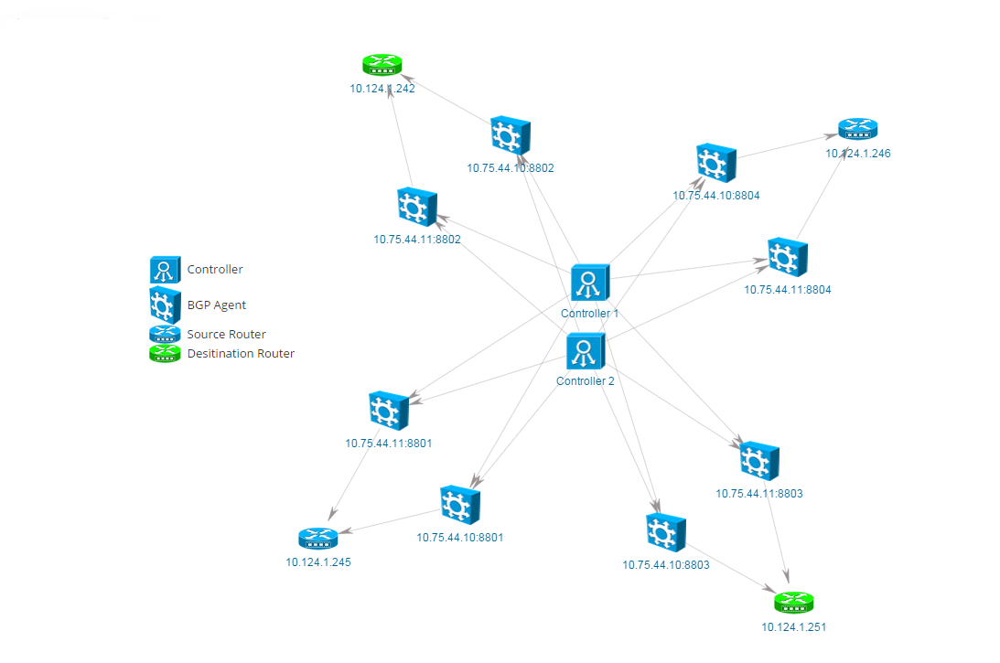

.. yabgp documentation master file, created by
   sphinx-quickstart on Fri May 15 10:18:44 2015.
   You can adapt this file completely to your liking, but it should at least
   contain the root `toctree` directive.

YABGP Project
=============

YABGP is a yet another Python implementation for BGP Protocol. It was born in
Cisco around 2011, we use it to establish BGP connections with all kinds
of routers (include real Cisco/HuaWei/Juniper routers and some router
simulators in Cisco like IOL/IOU) and receive/parse BGP messages for
future analysis. Now we open sourced it.

We write it accordance with the specifications of RFCs.

This software can be used on Linux/Unix, Mac OS and Windows systems.

Features
========

-  It can establish BGP session based on IPv4 address (TCP Layer) in
   active mode(as TCP client);

-  Support TCP MD5 authentication(IPv4 and does not support Windows
   now);

-  BGP capabilities support: 4 Bytes ASN, IPv4 address family, Route
   Refresh(Cisco Route Refresh);

-  Decode all BGP messages to human readable strings and write files to
   disk(configurable);

.. note::

  yabgp is a light weight BGP agent used for connecting network devices. It only can be
  TCP client in one BGP peering connection, and we recommend that each yabgp process connect
  only one BGP neighbor, so each process is independent with each other, we can start many yabgp
  processes within the same machine or in different machines.

Application
===========

There are many jobs need to do in future.

We want to use our `yabgp` agent in a large scale system like the picture below. We can start many yabgp instances in
the same machine or in different machines, each yabgp instance maintain one BGP peer connection.

In order to control the traffic in the customer's network, through the controller, we can decide which yabgp instance should send what kind of prefixs with different BGP attributes.
For example we can get the attributes of prefix A.B.0.0/16 through the yabgp instance `10.75.44.10:8801` who connected with router `10.124.1.245`, change some of the attributes,
then send one update with the new attribute to router `10.124.1.242` through yabgp instance `10.75.44.10:8802`.

We hope we can do all these kinds of jobs in future, So we need a powerful controller program and some kinds of interfaces(like REST) in yabgp code which can
be used to communicate with controller.

We are working hardly on that. So any of your ideas is welcome.

Quickstarts
===========

.. toctree::
   :maxdepth: 1

   install
   tutorial
   msg_format
   restapi
   reference

Support
=======

Please use GitHub issue system or submit pull request.

Indices and tables
==================

* :ref:`genindex`
* :ref:`modindex`
* :ref:`search`
